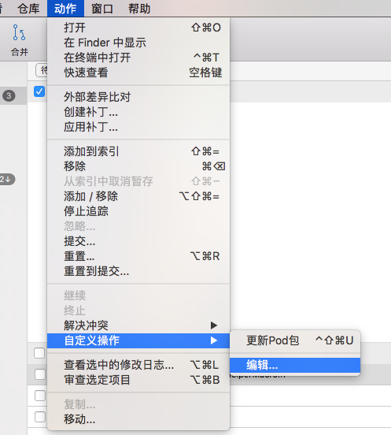
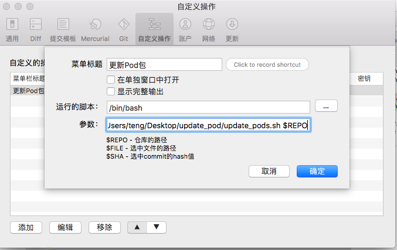
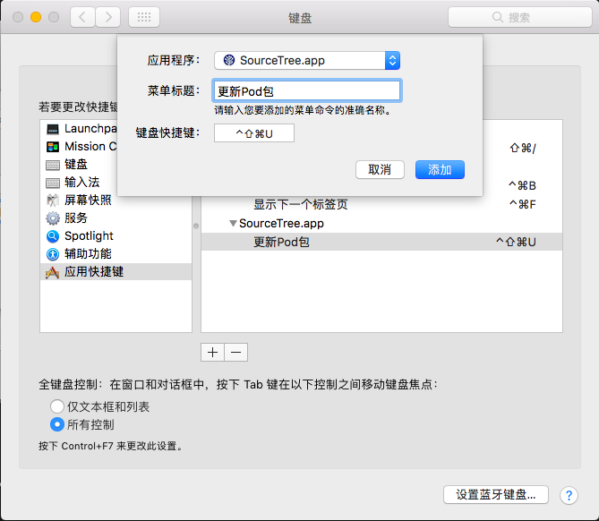

1.  保存脚本文件到任意路径,代码如下:
    
        REPO_PATH=$1;cd ${REPO_PATH};readonly REPO_PATH;Pods_zip=${REPO_PATH}"/Pods.zip";cd $REPO_PATH;unzip -o ${Pods_zip};open .;
2.  SourceTree 配置
    选择菜单栏->动作->自定义动作->编辑
    
    
    然后再点击添加,如下填写
    
    
    
    菜单标题则是命令名,随便取,这个名字在设置快捷键的时候有用到;
    其中参数一栏有两项参数:1:脚本路径 2:$REPO
    注意参数与参数之间要有空格
3.  设置快捷键
    打开系统偏好设置 -> 键盘 -> 快捷键 -> 选择左边的应用快捷键 -> 按下面的 + 按钮
    
    应用程序选择 SourceTree.app,菜单标题就是上面填写的自定义动作命令的名字.最后填入喜欢的快捷键;